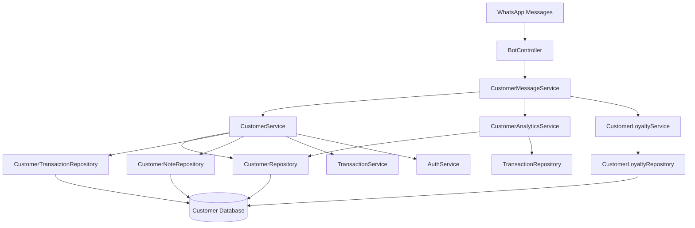

# Customer Management System Design

## Overview

The Customer Management System extends MonPetitBiz with comprehensive customer relationship management capabilities delivered through WhatsApp. The system automatically tracks customer interactions, purchase history, and provides analytics while maintaining the simple, conversational interface users expect.

The design leverages the existing business and transaction infrastructure, adding customer entities and services that integrate seamlessly with current workflows. The system emphasizes data privacy, business isolation, and intuitive WhatsApp-based interactions.

## Architecture

### High-Level Architecture



### Service Layer Architecture

The customer management system follows the established service-oriented architecture:

- **CustomerMessageService**: Handles WhatsApp message parsing and routing for customer commands
- **CustomerService**: Core business logic for customer CRUD operations and profile management
- **CustomerAnalyticsService**: Generates customer insights, statistics, and business intelligence
- **CustomerLoyaltyService**: Manages loyalty points, rewards, and customer retention features
- **CustomerSearchService**: Handles customer discovery and search functionality

## Components and Interfaces

### Core Entities

#### Customer Entity
```typescript
interface Customer {
  id: string;
  businessId: string;
  name: string;
  phoneNumber: string;
  encryptedPhone: string;
  country: string;
  registrationDate: Date;
  lastPurchaseDate?: Date;
  totalPurchases: number;
  totalSpent: number;
  loyaltyPoints: number;
  isActive: boolean;
  createdBy: string;
  createdAt: Date;
  updatedAt: Date;
}
```

#### CustomerTransaction Entity
```typescript
interface CustomerTransaction {
  id: string;
  customerId: string;
  transactionId: string;
  businessId: string;
  amount: number;
  pointsEarned: number;
  createdAt: Date;
}
```

#### CustomerNote Entity
```typescript
interface CustomerNote {
  id: string;
  customerId: string;
  businessId: string;
  content: string;
  noteType: 'general' | 'communication' | 'preference';
  createdBy: string;
  createdAt: Date;
}
```

#### CustomerLoyalty Entity
```typescript
interface CustomerLoyalty {
  id: string;
  customerId: string;
  businessId: string;
  pointsBalance: number;
  totalPointsEarned: number;
  totalPointsRedeemed: number;
  lastActivityDate: Date;
  milestoneLevel: number;
}
```

### Service Interfaces

#### CustomerService Interface
```typescript
interface ICustomerService {
  // Customer Management
  createCustomer(data: CreateCustomerDto): Promise<Customer>;
  findCustomerByPhone(phoneNumber: string, businessId: string): Promise<Customer>;
  findCustomerByName(name: string, businessId: string): Promise<Customer[]>;
  updateCustomer(customerId: string, data: UpdateCustomerDto): Promise<Customer>;
  
  // Customer Search
  searchCustomers(query: string, businessId: string): Promise<Customer[]>;
  getActiveCustomers(businessId: string, days?: number): Promise<Customer[]>;
  getLoyalCustomers(businessId: string, minPurchases?: number): Promise<Customer[]>;
  getNewCustomers(businessId: string, days?: number): Promise<Customer[]>;
  
  // Customer History
  getCustomerPurchaseHistory(customerId: string): Promise<CustomerPurchaseHistory>;
  linkTransactionToCustomer(transactionId: string, customerId: string): Promise<void>;
  
  // Customer Notes
  addCustomerNote(customerId: string, content: string, createdBy: string): Promise<CustomerNote>;
  getCustomerNotes(customerId: string): Promise<CustomerNote[]>;
}
```

#### CustomerAnalyticsService Interface
```typescript
interface ICustomerAnalyticsService {
  getCustomerStats(businessId: string): Promise<CustomerStats>;
  getTopCustomers(businessId: string, limit?: number): Promise<TopCustomer[]>;
  getCustomerInsights(businessId: string): Promise<CustomerInsights>;
  getCustomerRetentionMetrics(businessId: string): Promise<RetentionMetrics>;
  generateCustomerReport(businessId: string, period: string): Promise<CustomerReport>;
}
```

#### CustomerLoyaltyService Interface
```typescript
interface ICustomerLoyaltyService {
  awardPoints(customerId: string, amount: number): Promise<void>;
  redeemPoints(customerId: string, points: number, reason: string): Promise<void>;
  getPointsBalance(customerId: string): Promise<number>;
  checkMilestones(customerId: string): Promise<MilestoneReward[]>;
  configureLoyaltyProgram(businessId: string, config: LoyaltyConfig): Promise<void>;
}
```

### Message Processing Architecture

#### Customer Command Parser
```typescript
interface CustomerCommand {
  type: 'create' | 'info' | 'update' | 'search' | 'history' | 'note' | 'stats' | 'points';
  customerIdentifier?: string; // name or phone
  data?: any;
  businessId: string;
  userId: string;
}
```

#### Command Routing
The system extends the existing NLP service to recognize customer management commands:

- `client nouveau [nom] [téléphone]` → CREATE_CUSTOMER
- `client info [identifier]` → GET_CUSTOMER_INFO  
- `client historique [identifier]` → GET_CUSTOMER_HISTORY
- `client chercher [query]` → SEARCH_CUSTOMERS
- `client note [identifier] [note]` → ADD_CUSTOMER_NOTE
- `clients stats` → GET_CUSTOMER_ANALYTICS
- `client points [identifier]` → GET_LOYALTY_POINTS

## Data Models

### Database Schema

#### customers table
```sql
CREATE TABLE customers (
  id UUID PRIMARY KEY DEFAULT gen_random_uuid(),
  business_id UUID NOT NULL REFERENCES businesses(id),
  name VARCHAR(255) NOT NULL,
  phone_number VARCHAR(20) NOT NULL,
  encrypted_phone TEXT NOT NULL,
  country VARCHAR(10) NOT NULL,
  registration_date TIMESTAMP NOT NULL DEFAULT NOW(),
  last_purchase_date TIMESTAMP,
  total_purchases INTEGER DEFAULT 0,
  total_spent DECIMAL(10,2) DEFAULT 0,
  loyalty_points INTEGER DEFAULT 0,
  is_active BOOLEAN DEFAULT true,
  created_by UUID NOT NULL REFERENCES users(id),
  created_at TIMESTAMP DEFAULT NOW(),
  updated_at TIMESTAMP DEFAULT NOW(),
  
  UNIQUE(business_id, phone_number),
  INDEX idx_customers_business_phone (business_id, phone_number),
  INDEX idx_customers_business_name (business_id, name),
  INDEX idx_customers_business_active (business_id, is_active),
  INDEX idx_customers_last_purchase (business_id, last_purchase_date)
);
```

#### customer_transactions table
```sql
CREATE TABLE customer_transactions (
  id UUID PRIMARY KEY DEFAULT gen_random_uuid(),
  customer_id UUID NOT NULL REFERENCES customers(id),
  transaction_id UUID NOT NULL REFERENCES transactions(id),
  business_id UUID NOT NULL REFERENCES businesses(id),
  amount DECIMAL(10,2) NOT NULL,
  points_earned INTEGER DEFAULT 0,
  created_at TIMESTAMP DEFAULT NOW(),
  
  UNIQUE(customer_id, transaction_id),
  INDEX idx_customer_transactions_customer (customer_id),
  INDEX idx_customer_transactions_business (business_id)
);
```

#### customer_notes table
```sql
CREATE TABLE customer_notes (
  id UUID PRIMARY KEY DEFAULT gen_random_uuid(),
  customer_id UUID NOT NULL REFERENCES customers(id),
  business_id UUID NOT NULL REFERENCES businesses(id),
  content TEXT NOT NULL,
  note_type VARCHAR(20) DEFAULT 'general',
  created_by UUID NOT NULL REFERENCES users(id),
  created_at TIMESTAMP DEFAULT NOW(),
  
  INDEX idx_customer_notes_customer (customer_id),
  INDEX idx_customer_notes_business_date (business_id, created_at)
);
```

#### customer_loyalty table
```sql
CREATE TABLE customer_loyalty (
  id UUID PRIMARY KEY DEFAULT gen_random_uuid(),
  customer_id UUID NOT NULL REFERENCES customers(id) UNIQUE,
  business_id UUID NOT NULL REFERENCES businesses(id),
  points_balance INTEGER DEFAULT 0,
  total_points_earned INTEGER DEFAULT 0,
  total_points_redeemed INTEGER DEFAULT 0,
  last_activity_date TIMESTAMP DEFAULT NOW(),
  milestone_level INTEGER DEFAULT 0,
  created_at TIMESTAMP DEFAULT NOW(),
  updated_at TIMESTAMP DEFAULT NOW(),
  
  INDEX idx_customer_loyalty_business (business_id),
  INDEX idx_customer_loyalty_points (business_id, points_balance)
);
```

### Data Relationships

- **Customer** belongs to **Business** (business isolation)
- **Customer** has many **CustomerTransactions** (purchase history)
- **Customer** has many **CustomerNotes** (communication tracking)
- **Customer** has one **CustomerLoyalty** (points and rewards)
- **CustomerTransaction** links **Customer** and **Transaction**
- **CustomerNote** belongs to **Customer** and created by **User**

## Error Handling

### Customer-Specific Error Types

```typescript
enum CustomerErrorType {
  CUSTOMER_NOT_FOUND = 'CUSTOMER_NOT_FOUND',
  DUPLICATE_CUSTOMER = 'DUPLICATE_CUSTOMER',
  INVALID_PHONE_NUMBER = 'INVALID_PHONE_NUMBER',
  INSUFFICIENT_POINTS = 'INSUFFICIENT_POINTS',
  CUSTOMER_INACTIVE = 'CUSTOMER_INACTIVE',
  UNAUTHORIZED_ACCESS = 'UNAUTHORIZED_ACCESS'
}
```

### Error Handling Strategy

1. **Validation Errors**: Return user-friendly messages in French with correction suggestions
2. **Not Found Errors**: Offer to create new customer or suggest similar matches
3. **Permission Errors**: Ensure business isolation and role-based access
4. **Data Integrity**: Handle phone number conflicts and duplicate prevention
5. **Loyalty Errors**: Clear messaging about point balances and redemption rules

### Error Messages (French)

```typescript
const CustomerErrorMessages = {
  CUSTOMER_NOT_FOUND: "❌ Client non trouvé. Vérifiez le nom ou numéro, ou tapez 'client nouveau [nom] [téléphone]' pour créer un nouveau client.",
  DUPLICATE_CUSTOMER: "⚠️ Ce numéro existe déjà. Tapez 'client info [numéro]' pour voir les détails.",
  INVALID_PHONE_NUMBER: "❌ Format de numéro invalide. Utilisez le format: +226XXXXXXXXX",
  INSUFFICIENT_POINTS: "❌ Points insuffisants. Solde actuel: {balance} points.",
  CUSTOMER_INACTIVE: "⚠️ Client inactif. Tapez 'client activer [nom]' pour réactiver.",
  UNAUTHORIZED_ACCESS: "❌ Accès non autorisé à ces données client."
};
```

## Testing Strategy

### Unit Testing Approach

1. **Service Layer Tests**
   - Customer CRUD operations
   - Search and filtering logic
   - Analytics calculations
   - Loyalty point calculations
   - Data validation and sanitization

2. **Repository Layer Tests**
   - Database query correctness
   - Business isolation enforcement
   - Index usage optimization
   - Transaction handling

3. **Message Processing Tests**
   - Command parsing accuracy
   - Response formatting
   - Error message generation
   - Integration with existing NLP

### Integration Testing Approach

1. **End-to-End Customer Flows**
   - Complete customer registration process
   - Transaction linking and history tracking
   - Loyalty point earning and redemption
   - Customer search and analytics

2. **Business Isolation Tests**
   - Cross-business data access prevention
   - Role-based permission enforcement
   - Data privacy compliance

3. **Performance Tests**
   - Customer search response times
   - Analytics generation performance
   - Large dataset handling
   - Concurrent user scenarios

### Test Data Strategy

- **Mock Customer Data**: Realistic French names and Senegalese phone numbers
- **Business Scenarios**: Multiple businesses with different customer bases
- **Transaction History**: Varied purchase patterns for analytics testing
- **Edge Cases**: Inactive customers, duplicate data, invalid inputs

## Security and Privacy

### Data Protection Measures

1. **Phone Number Encryption**: Store encrypted versions of phone numbers
2. **Business Isolation**: Strict enforcement of business-level data access
3. **Role-Based Access**: Different permissions for owners vs employees
4. **Audit Logging**: Track all customer data access and modifications
5. **Data Retention**: Configurable retention policies for customer data

### Privacy Compliance

1. **Data Minimization**: Only collect necessary customer information
2. **Consent Management**: Clear communication about data usage
3. **Right to Deletion**: Ability to remove customer profiles
4. **Data Portability**: Export customer data in standard formats
5. **Access Controls**: Granular permissions for customer data access

### Security Implementation

```typescript
interface CustomerSecurityService {
  encryptPhoneNumber(phoneNumber: string): string;
  decryptPhoneNumber(encryptedPhone: string): string;
  maskPhoneNumber(phoneNumber: string): string;
  validateBusinessAccess(customerId: string, businessId: string): boolean;
  auditCustomerAccess(userId: string, customerId: string, action: string): void;
}
```

## Performance Considerations

### Database Optimization

1. **Indexing Strategy**
   - Composite indexes on business_id + frequently queried fields
   - Partial indexes for active customers only
   - Text search indexes for customer names

2. **Query Optimization**
   - Pagination for large customer lists
   - Efficient joins for customer analytics
   - Caching for frequently accessed customer data

3. **Data Archiving**
   - Archive inactive customers after configurable period
   - Maintain transaction history while archiving customer profiles
   - Efficient storage for historical analytics

### Caching Strategy

1. **Customer Profile Caching**: Cache frequently accessed customer profiles
2. **Analytics Caching**: Cache daily/weekly analytics with TTL
3. **Search Result Caching**: Cache common search queries
4. **Loyalty Point Caching**: Cache point balances with invalidation on updates

### Scalability Considerations

1. **Horizontal Scaling**: Design for multiple database replicas
2. **Service Separation**: Independent scaling of customer services
3. **Event-Driven Updates**: Async processing for analytics updates
4. **Batch Processing**: Efficient bulk operations for data imports/exports