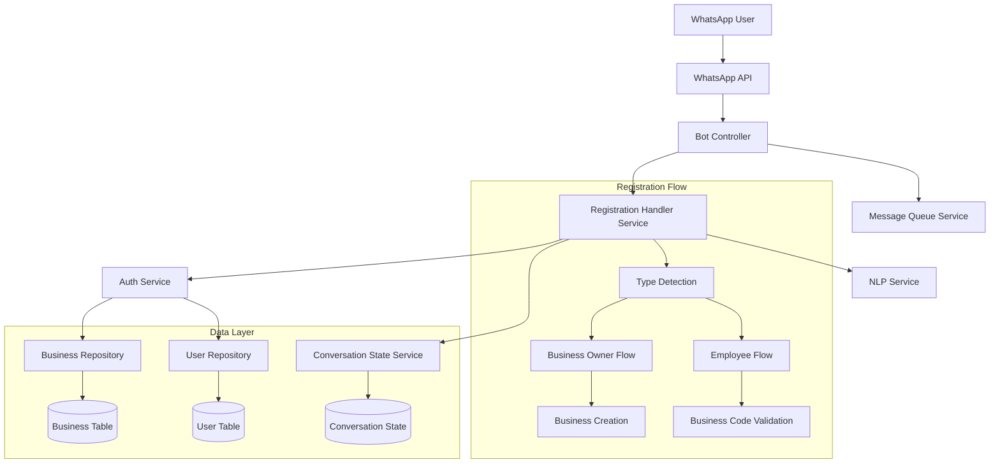
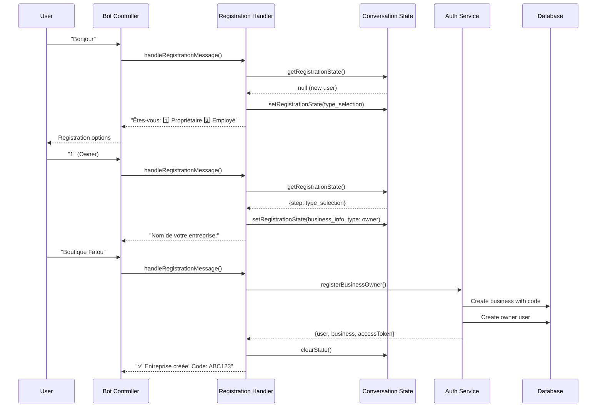
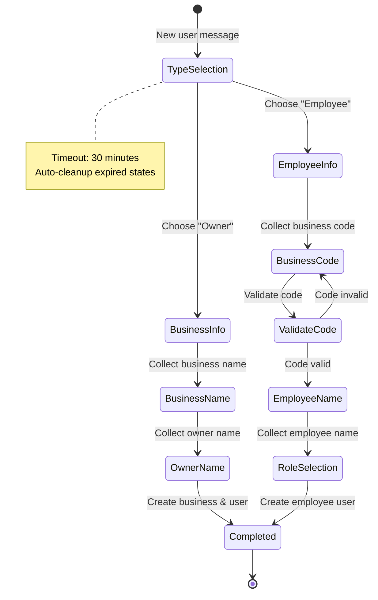

# Design Document

## Overview

The Employee Registration System is designed as a conversational WhatsApp bot feature that enables seamless onboarding of business owners and employees through a multi-step registration flow. The system uses a business code approach to eliminate complex information gathering while maintaining security and proper access control.

The design follows a state-machine pattern for conversation management, with clear separation of concerns between authentication, business logic, and user interface layers. The system integrates with the existing WhatsApp bot infrastructure while adding new capabilities for user onboarding and role-based access control.

## Architecture

### High-Level Architecture



### Component Interaction Flow



## Components and Interfaces

### 1. Registration Handler Service

**Purpose**: Orchestrates the multi-step registration process and manages conversation flows.

**Key Methods**:
```typescript
interface RegistrationHandlerService {
  handleRegistrationMessage(phoneNumber: string, message: string): Promise<RegistrationResponse>
  startRegistrationFlow(phoneNumber: string, message: string): Promise<RegistrationResponse>
  continueRegistrationFlow(phoneNumber: string, message: string, state: RegistrationState): Promise<RegistrationResponse>
  isInRegistrationFlow(phoneNumber: string): boolean
  cancelRegistration(phoneNumber: string): void
}

interface RegistrationResponse {
  message: string
  completed: boolean
  nextStep?: string
  requiresOTP?: boolean
  data?: any
}
```

**Responsibilities**:
- Detect registration intent from user messages
- Route users to appropriate registration flows
- Validate user inputs at each step
- Coordinate with Auth Service for user creation
- Manage error handling and user guidance

### 2. Conversation State Service

**Purpose**: Manages conversation state and context for multi-step interactions.

**Key Methods**:
```typescript
interface ConversationStateService {
  getState(phoneNumber: string): ConversationState | null
  setState(phoneNumber: string, step: string, data: Record<string, any>): void
  updateState(phoneNumber: string, data: Record<string, any>): void
  clearState(phoneNumber: string): void
  isInRegistration(phoneNumber: string): boolean
  getRegistrationState(phoneNumber: string): RegistrationState | null
  setRegistrationState(phoneNumber: string, state: Partial<RegistrationState>): void
}

interface RegistrationState {
  step: 'type_selection' | 'phone_verification' | 'business_info' | 'employee_info' | 'role_selection'
  type?: 'owner' | 'employee'
  phoneNumber?: string
  businessCode?: string
  businessName?: string
  employeeName?: string
  role?: 'owner' | 'seller' | 'manager'
}
```

**Responsibilities**:
- Store conversation context in memory
- Handle session timeouts and cleanup
- Provide type-safe access to registration state
- Manage conversation expiration (30 minutes)

### 3. Enhanced Auth Service

**Purpose**: Extended authentication service with business code management and employee registration.

**New Methods**:
```typescript
interface AuthService {
  // Existing methods...
  registerBusinessOwner(registerDto: RegisterUserDto): Promise<AuthResult>
  registerEmployee(phoneNumber: string, businessCode: string, employeeName: string, role: 'seller' | 'manager', language?: string): Promise<AuthResult>
  getBusinessByCode(businessCode: string): Promise<Business | null>
  generateBusinessCode(): string
}
```

**Responsibilities**:
- Generate unique 6-character business codes
- Validate business codes during employee registration
- Create business entities with proper relationships
- Assign appropriate roles and permissions
- Handle registration errors and conflicts

### 4. Enhanced Data Models

**Business Entity Extensions**:
```typescript
@Entity('businesses')
export class Business {
  @PrimaryGeneratedColumn('uuid')
  id: string

  @Column({ length: 100 })
  name: string

  @Column({ length: 6, unique: true })
  businessCode: string  // New field

  @Column({ length: 3, default: 'XOF' })
  currency: string

  @Column({ length: 50, default: 'Africa/Dakar' })
  timezone: string

  @OneToMany(() => User, user => user.business)
  users: User[]
}
```

**User Entity Extensions**:
```typescript
@Entity('users')
export class User {
  // Existing fields...
  
  @Column({ length: 100, nullable: true })
  employeeName?: string  // New field for employee display name

  @Column({ type: 'enum', enum: UserRole })
  role: UserRole  // Enhanced with 'manager' role
}
```

## Data Models

### Business Code Generation Strategy

**Algorithm**: 
- Generate 6-character alphanumeric codes (A-Z, 0-9)
- Exclude confusing characters (0/O, 1/I/L)
- Ensure uniqueness through database constraints
- Retry generation if collision occurs

**Implementation**:
```typescript
private generateBusinessCode(): string {
  const chars = 'ABCDEFGHJKMNPQRSTUVWXYZ23456789'; // Excludes confusing chars
  let result = '';
  for (let i = 0; i < 6; i++) {
    result += chars.charAt(Math.floor(Math.random() * chars.length));
  }
  return result;
}
```

### Role-Based Permission Matrix

| Permission | Owner | Manager | Seller |
|------------|-------|---------|--------|
| Record Sales | ✅ | ✅ | ✅ |
| Record Expenses | ✅ | ✅ | ❌ |
| Manage Stock | ✅ | ✅ | ❌ |
| View Reports | ✅ | ✅ | ❌ |
| Generate PDF | ✅ | ✅ | ❌ |
| Add Employees | ✅ | ❌ | ❌ |
| View Business Code | ✅ | ❌ | ❌ |
| Manage Business Settings | ✅ | ❌ | ❌ |

### Conversation State Management

**State Transitions**:


## Error Handling

### Error Categories and Responses

**1. Validation Errors**
- Invalid business code format → "Code invalide. Format attendu: ABC123"
- Business code not found → "Code inexistant. Vérifiez avec votre patron."
- Duplicate phone number → "Numéro déjà enregistré. Contactez le support."

**2. System Errors**
- Database connection issues → "Erreur temporaire. Réessayez dans quelques minutes."
- External service failures → "Service indisponible. Nous travaillons à résoudre le problème."

**3. User Input Errors**
- Unexpected response format → "Répondez par 1 ou 2 pour choisir votre type de compte."
- Empty or invalid input → "Veuillez saisir [information attendue]. Exemple: [exemple]"

**4. Business Logic Errors**
- Business creation failure → "Impossible de créer l'entreprise. Vérifiez les informations."
- Role assignment failure → "Erreur d'attribution de rôle. Contactez le support."

### Error Recovery Strategies

**Graceful Degradation**:
- Maintain conversation state during errors
- Provide clear next steps for recovery
- Allow users to restart registration if needed
- Log errors for debugging while showing user-friendly messages

**Retry Mechanisms**:
- Automatic retry for transient database errors
- User-initiated retry for validation errors
- Exponential backoff for external service calls

## Testing Strategy

### Unit Testing Approach

**1. Registration Handler Service Tests**
```typescript
describe('RegistrationHandlerService', () => {
  it('should detect registration intent from greeting messages')
  it('should route business owners to correct flow')
  it('should route employees to correct flow')
  it('should validate business codes correctly')
  it('should handle invalid inputs gracefully')
  it('should complete registration successfully')
})
```

**2. Conversation State Service Tests**
```typescript
describe('ConversationStateService', () => {
  it('should store and retrieve conversation state')
  it('should handle state expiration correctly')
  it('should clean up expired conversations')
  it('should provide type-safe registration state access')
})
```

**3. Auth Service Tests**
```typescript
describe('AuthService - Registration', () => {
  it('should generate unique business codes')
  it('should create business owner with valid code')
  it('should register employee with valid business code')
  it('should reject invalid business codes')
  it('should handle duplicate registrations')
})
```

### Integration Testing Strategy

**1. End-to-End Registration Flows**
- Complete business owner registration journey
- Complete employee registration journey
- Error scenarios and recovery paths
- Multi-user concurrent registrations

**2. WhatsApp Integration Tests**
- Message parsing and response formatting
- Conversation state persistence across messages
- Timeout handling and cleanup
- Error message delivery

**3. Database Integration Tests**
- Business code uniqueness constraints
- User-business relationship integrity
- Role assignment and permission validation
- Data consistency during concurrent operations

### Mock Strategy for External Dependencies

**WhatsApp API Mocking**:
```typescript
const mockWhatsAppService = {
  sendMessage: jest.fn().mockResolvedValue({ success: true }),
  sendOTP: jest.fn().mockResolvedValue({ success: true }),
  validateOTP: jest.fn().mockResolvedValue({ valid: true })
}
```

**Database Mocking**:
```typescript
const mockBusinessRepository = {
  findOne: jest.fn(),
  save: jest.fn(),
  create: jest.fn()
}
```

### Performance Testing Considerations

**Load Testing Scenarios**:
- Concurrent user registrations
- High-frequency message processing
- Database query performance under load
- Memory usage during peak conversations

**Metrics to Monitor**:
- Registration completion rate
- Average registration time
- Error rate by step
- Conversation state memory usage
- Database query response times

## Security Considerations

### Data Protection
- Phone number validation and sanitization
- Business code generation with sufficient entropy
- Secure storage of conversation state (in-memory only)
- Audit logging for registration events

### Access Control
- Role-based permission enforcement
- Business code validation before employee access
- Session timeout and cleanup
- Prevention of unauthorized business access

### Input Validation
- Sanitize all user inputs
- Validate business code format
- Prevent injection attacks through message content
- Rate limiting for registration attempts