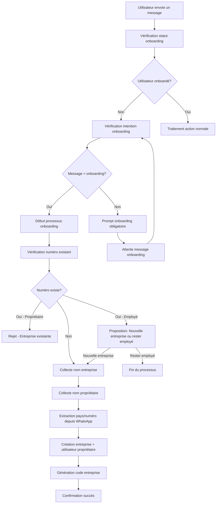

# Design Document - Système d'Onboarding des Marchands

## Overview

Ce document décrit la conception d'un système d'onboarding conversationnel pour les marchands via WhatsApp. Le système s'intègre à l'architecture existante en étendant le service `RegistrationHandlerService` pour supporter la création d'entreprises avec validation d'unicité des numéros de téléphone et gestion des codes d'employé.

Le système utilise une approche conversationnelle guidée qui collecte les informations nécessaires étape par étape, valide l'unicité des numéros de téléphone, et gère intelligemment les cas où un utilisateur existe déjà dans le système.

## Architecture

### Vue d'ensemble du flux



### Intégration avec l'architecture existante

Le système s'intègre aux composants existants :

- **WhatsAppService** : Ajout du middleware de vérification d'onboarding avant traitement des messages
- **RegistrationHandlerService** : Extension pour supporter le nouveau flux d'onboarding
- **AuthService** : Utilisation des méthodes existantes pour la création d'utilisateurs et d'entreprises
- **ConversationStateService** : Gestion de l'état conversationnel pendant l'onboarding
- **Entités existantes** : Business, User, EmployeeCode

### Flux de vérification préalable

Avant de traiter toute action (vente, stock, rapport, etc.), le système vérifie :

1. **Statut d'onboarding** : L'utilisateur est-il enregistré dans le système ?
2. **Type d'action** : L'action demandée nécessite-t-elle un onboarding ?
3. **Redirection** : Si non onboardé, redirection vers le processus d'onboarding

## Components and Interfaces

### 1. Middleware de Vérification d'Onboarding

```typescript
interface OnboardingCheckMiddleware {
  checkUserOnboardingStatus(phoneNumber: string): Promise<{
    isOnboarded: boolean;
    userType?: 'owner' | 'employee';
    businessName?: string;
    requiresOnboarding: boolean;
  }>;
  
  generateOnboardingPrompt(phoneNumber: string): Promise<string>;
  
  isOnboardingAction(message: string): boolean;
}

interface OnboardingGuard {
  canExecuteAction(phoneNumber: string, action: string): Promise<{
    allowed: boolean;
    reason?: string;
    onboardingPrompt?: string;
  }>;
}
```

### 2. Extension du RegistrationHandlerService

```typescript
interface MerchantOnboardingState extends RegistrationState {
  step: 'merchant_onboarding_start' | 'business_name' | 'owner_name' | 'confirmation';
  businessName?: string;
  ownerName?: string;
  phoneNumber: string;
  country?: string;
  extractedPhoneNumber?: string;
}

interface OnboardingResponse extends RegistrationResponse {
  businessCode?: string;
  conflictType?: 'owner_exists' | 'employee_exists';
  suggestedActions?: string[];
}
```

### 2. Service de Validation des Numéros

```typescript
interface PhoneValidationService {
  extractCountryFromWhatsApp(phoneNumber: string): Promise<{
    country: string;
    formattedNumber: string;
    isValid: boolean;
  }>;
  
  checkPhoneNumberStatus(phoneNumber: string): Promise<{
    exists: boolean;
    userType?: 'owner' | 'employee';
    businessName?: string;
    businessId?: string;
  }>;
}
```

### 3. Service de Gestion des Conflits

```typescript
interface ConflictResolutionService {
  handleExistingOwner(phoneNumber: string): Promise<OnboardingResponse>;
  handleExistingEmployee(phoneNumber: string): Promise<OnboardingResponse>;
  proposeEmployeeOptions(phoneNumber: string): Promise<OnboardingResponse>;
}
```

### 4. Extension du AuthService

```typescript
interface BusinessCreationRequest {
  phoneNumber: string;
  businessName: string;
  ownerName: string;
  country: string;
  language?: string;
}

interface BusinessCreationResult {
  business: Business;
  owner: User;
  businessCode: string;
  accessToken: string;
}
```

## Data Models

### Extensions aux entités existantes

Les entités existantes (Business, User, EmployeeCode) sont suffisantes. Ajouts mineurs nécessaires :

#### Business Entity
```typescript
// Ajout optionnel pour traçabilité
@Column({ name: 'owner_name', type: 'varchar', length: 100, nullable: true })
ownerName?: string;

@Column({ name: 'country', type: 'varchar', length: 3, nullable: true })
country?: string;
```

#### User Entity
```typescript
// Déjà présent, mais s'assurer que ces champs sont utilisés
@Column({ name: 'employee_name', type: 'varchar', length: 100, nullable: true })
employeeName: string;

@Column({ name: 'invited_by', type: 'uuid', nullable: true })
invitedBy: string;
```

### État conversationnel

```typescript
interface MerchantOnboardingConversationState {
  phoneNumber: string;
  step: 'business_name' | 'owner_name' | 'conflict_resolution';
  businessName?: string;
  ownerName?: string;
  country?: string;
  conflictType?: 'owner_exists' | 'employee_exists';
  attempts: number;
  startedAt: Date;
  lastActivity: Date;
}
```

### 5. Intégration avec les Services Existants

```typescript
interface WhatsAppMessageInterceptor {
  interceptMessage(phoneNumber: string, message: string): Promise<{
    shouldProcess: boolean;
    response?: string;
    redirectToOnboarding?: boolean;
  }>;
}

interface ActionValidator {
  validateUserCanPerformAction(phoneNumber: string, actionType: string): Promise<{
    canPerform: boolean;
    reason?: string;
    requiredOnboarding?: boolean;
  }>;
}
```

### Messages de redirection vers l'onboarding

```typescript
const ONBOARDING_PROMPTS = {
  general: "👋 Bienvenue ! Pour utiliser ce service, vous devez d'abord créer votre compte.\n\n📝 Tapez 'créer une nouvelle entreprise' pour commencer.",
  
  afterSaleAttempt: "💰 Pour enregistrer des ventes, vous devez d'abord créer votre entreprise.\n\n📝 Tapez 'créer une nouvelle entreprise' pour commencer l'inscription.",
  
  afterStockAttempt: "📦 Pour gérer votre stock, vous devez d'abord créer votre entreprise.\n\n📝 Tapez 'créer une nouvelle entreprise' pour commencer l'inscription.",
  
  afterReportAttempt: "📊 Pour consulter vos rapports, vous devez d'abord créer votre entreprise.\n\n📝 Tapez 'créer une nouvelle entreprise' pour commencer l'inscription."
};
```

## Error Handling

### Types d'erreurs et gestion

1. **Erreurs de validation**
   - Nom d'entreprise invalide (trop court/long, caractères spéciaux)
   - Nom de propriétaire invalide
   - Numéro de téléphone non extractible

2. **Erreurs de conflit**
   - Numéro déjà propriétaire d'une entreprise
   - Numéro déjà employé dans une entreprise

3. **Erreurs techniques**
   - Échec de création en base de données
   - Problème de génération du code entreprise
   - Erreur de communication WhatsApp

4. **Erreurs d'accès non autorisé**
   - Tentative d'action sans onboarding
   - Utilisateur non reconnu dans le système

### Stratégies de récupération

```typescript
interface ErrorRecoveryStrategy {
  maxRetries: number;
  backoffStrategy: 'linear' | 'exponential';
  fallbackActions: string[];
  userGuidance: string;
}

const errorStrategies = {
  validation: {
    maxRetries: 3,
    backoffStrategy: 'linear',
    fallbackActions: ['provide_examples', 'offer_help'],
    userGuidance: 'Exemples et format attendu'
  },
  conflict: {
    maxRetries: 1,
    backoffStrategy: 'linear', 
    fallbackActions: ['explain_options', 'contact_support'],
    userGuidance: 'Options disponibles selon le type de conflit'
  },
  technical: {
    maxRetries: 2,
    backoffStrategy: 'exponential',
    fallbackActions: ['retry_later', 'contact_support'],
    userGuidance: 'Réessayer ou contacter le support'
  },
  unauthorized: {
    maxRetries: 0,
    backoffStrategy: 'linear',
    fallbackActions: ['redirect_to_onboarding'],
    userGuidance: 'Redirection vers le processus d\'onboarding'
  }
};
```

## Testing Strategy

### 1. Tests unitaires

**Services à tester :**
- `MerchantOnboardingHandler` : Logique de flux conversationnel
- `PhoneValidationService` : Extraction et validation des numéros
- `ConflictResolutionService` : Gestion des conflits
- Extensions du `AuthService` : Création d'entreprises

**Scénarios de test :**
- Flux nominal de création d'entreprise
- Validation des entrées utilisateur
- Gestion des conflits (propriétaire/employé existant)
- Extraction du pays depuis le numéro WhatsApp
- Génération des codes d'entreprise

### 2. Tests d'intégration

**Flux complets à tester :**
- Onboarding complet nouveau marchand
- Tentative de création avec numéro existant (propriétaire)
- Tentative de création avec numéro existant (employé)
- Gestion des erreurs et récupération
- Intégration avec le système d'authentification

### 3. Tests de conversation

**Scénarios conversationnels :**
- Messages d'intention variés ("créer une nouvelle entreprise", "nouvelle entreprise", etc.)
- Gestion des erreurs de saisie et corrections
- Abandon et reprise de conversation
- Messages d'aide et guidance
- Gestion des timeouts de session

### 4. Tests de charge

**Scénarios de performance :**
- Création simultanée de multiples entreprises
- Validation de l'unicité sous charge
- Performance de l'extraction des numéros de téléphone
- Gestion des états conversationnels multiples

### Structure des tests

```typescript
describe('MerchantOnboardingSystem', () => {
  describe('PhoneValidationService', () => {
    it('should extract country from WhatsApp number');
    it('should detect existing owner');
    it('should detect existing employee');
    it('should handle invalid numbers');
  });

  describe('ConflictResolutionService', () => {
    it('should reject existing owner creation');
    it('should propose options to existing employee');
    it('should handle edge cases');
  });

  describe('OnboardingFlow', () => {
    it('should complete full onboarding flow');
    it('should handle validation errors gracefully');
    it('should maintain conversation state');
    it('should generate business codes correctly');
  });

  describe('Integration', () => {
    it('should integrate with existing auth system');
    it('should create proper database records');
    it('should handle concurrent registrations');
  });
});
```

## Considérations de sécurité

1. **Validation des entrées** : Sanitisation de tous les inputs utilisateur
2. **Unicité des codes** : Génération sécurisée des codes d'entreprise
3. **Gestion des sessions** : Timeout et nettoyage des états conversationnels
4. **Audit trail** : Logging des tentatives de création et des conflits
5. **Rate limiting** : Protection contre les tentatives de spam

## Performance et scalabilité

1. **Cache des validations** : Mise en cache des vérifications de numéros fréquentes
2. **Optimisation des requêtes** : Index sur les numéros de téléphone
3. **Gestion des états** : Nettoyage automatique des sessions expirées
4. **Monitoring** : Métriques sur les taux de succès et d'abandon