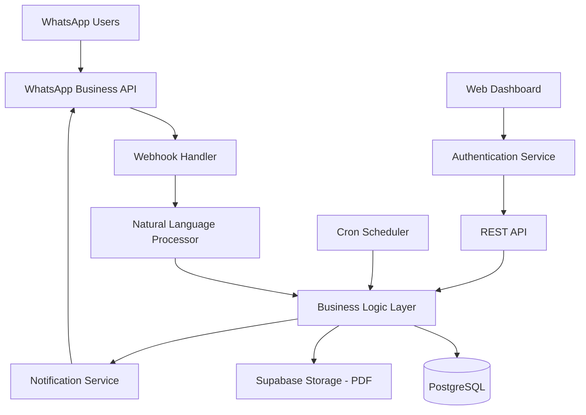

# Design Document - WhatsApp Bot MVP

## Overview

Le système est conçu comme une architecture microservices avec un bot WhatsApp comme interface principale, un backend API robuste, et un dashboard web minimal. L'architecture privilégie la simplicité, la fiabilité et la performance pour des utilisateurs avec des connexions limitées.

## Architecture

### Architecture Générale



### Stack Technique

- **Backend**: NestJS (Node.js + TypeScript)
- **Base de données**: PostgreSQL (Supabase)
- **Stockage fichiers**: Supabase Storage (PDF)
- **WhatsApp**: Twilio (Meta Cloud API en option / fallback selon config)
- **Frontend**: Next.js avec authentification JWT
- **Déploiement**: Vercel (API Nest)
- **Monitoring**: logs Vercel + Sentry (optionnel)

## Components and Interfaces

### 1. WhatsApp Interface Layer

**Webhook Handler**
```typescript
interface WebhookPayload {
  object: string;
  entry: Array<{
    id: string;
    changes: Array<{
      value: {
        messages?: Message[];
        statuses?: Status[];
      }
    }>
  }>;
}

interface Message {
  id: string;
  from: string;
  timestamp: string;
  text: {
    body: string;
  };
  type: 'text' | 'document' | 'image';
}
```

**Message Processor**
- Validation des messages entrants
- Routage vers le processeur de langage naturel
- Gestion des erreurs et timeouts
- Rate limiting par utilisateur

### 2. Natural Language Processing

**Command Parser**
```typescript
interface ParsedCommand {
  type: 'sale' | 'expense' | 'stock' | 'report' | 'balance';
  amount?: number;
  product?: string;
  description?: string;
  period?: 'day' | 'week' | 'month';
  confidence: number;
}

class CommandParser {
  parseMessage(text: string, language: string): ParsedCommand;
  extractAmount(text: string): number | null;
  extractProduct(text: string): string | null;
  detectLanguage(text: string): string;
}
```

**Patterns de reconnaissance**
- Regex patterns pour commandes structurées
- Dictionnaire multilingue (FR + langues locales)
- Fallback vers parsing simple si NL échoue
- Validation des montants et formats

### 3. Business Logic Layer

**Transaction Service**
```typescript
interface Transaction {
  id: string;
  businessId: string;
  userId: string;
  type: 'sale' | 'expense';
  amount: number;
  currency: string;
  product?: string;
  description?: string;
  timestamp: Date;
}

class TransactionService {
  recordSale(businessId: string, userId: string, data: SaleData): Promise<Transaction>;
  recordExpense(businessId: string, userId: string, data: ExpenseData): Promise<Transaction>;
  getBalance(businessId: string, period: Period): Promise<BalanceReport>;
}
```

**Stock Service**
```typescript
interface StockItem {
  id: string;
  businessId: string;
  product: string;
  quantity: number;
  lastUpdated: Date;
}

class StockService {
  updateStock(businessId: string, product: string, quantity: number): Promise<StockItem>;
  getStock(businessId: string, product?: string): Promise<StockItem[]>;
  decrementStock(businessId: string, product: string, quantity: number): Promise<boolean>;
}
```

**Report Service**
```typescript
interface BalanceReport {
  period: string;
  totalSales: number;
  totalExpenses: number;
  netProfit: number;
  transactionCount: number;
  topProducts?: Array<{product: string, revenue: number}>;
}

class ReportService {
  generateDailyReport(businessId: string): Promise<BalanceReport>;
  generatePDFReport(businessId: string, period: Period): Promise<string>; // signed storage URL
  scheduleAutomaticReports(): void;
}
```

### 4. Authentication & Authorization

**User Management**
```typescript
interface User {
  id: string;
  phoneNumber: string;
  businessId: string;
  role: 'owner' | 'seller';
  language: string;
  timezone: string;
  isActive: boolean;
}

class AuthService {
  sendOTP(phoneNumber: string): Promise<string>;
  verifyOTP(phoneNumber: string, code: string): Promise<User>;
  getUserByPhone(phoneNumber: string): Promise<User | null>;
  hasPermission(userId: string, action: string): Promise<boolean>;
}
```

**Permissions Matrix**
- Owner: Toutes les opérations (ventes, dépenses, stock, rapports)
- Seller: Ventes et stock uniquement
- Validation des permissions avant chaque action

### 5. Web Dashboard

**Dashboard API**
```typescript
interface DashboardData {
  summary: {
    todaySales: number;
    todayExpenses: number;
    todayProfit: number;
  };
  recentTransactions: Transaction[];
  stockLevels: StockItem[];
  monthlyTrend: Array<{date: string, sales: number, expenses: number}>;
}

class DashboardController {
  @Get('/dashboard/:businessId')
  getDashboardData(@Param('businessId') businessId: string): Promise<DashboardData>;
}
```

**Frontend Components**
- Page d'authentification (OTP)
- Dashboard principal (lecture seule)
- Liste des transactions avec filtres
- Graphiques simples (Chart.js)
- Export PDF des rapports

## Data Models

### Database Schema

```sql
-- Businesses
CREATE TABLE businesses (
  id UUID PRIMARY KEY DEFAULT gen_random_uuid(),
  name VARCHAR(255) NOT NULL,
  currency VARCHAR(3) DEFAULT 'XOF',
  timezone VARCHAR(50) DEFAULT 'Africa/Dakar',
  created_at TIMESTAMP DEFAULT NOW()
);

-- Users
CREATE TABLE users (
  id UUID PRIMARY KEY DEFAULT gen_random_uuid(),
  phone_number VARCHAR(20) UNIQUE NOT NULL,
  business_id UUID REFERENCES businesses(id),
  role VARCHAR(10) CHECK (role IN ('owner', 'seller')),
  language VARCHAR(5) DEFAULT 'fr',
  is_active BOOLEAN DEFAULT true,
  created_at TIMESTAMP DEFAULT NOW()
);

-- Transactions
CREATE TABLE transactions (
  id UUID PRIMARY KEY DEFAULT gen_random_uuid(),
  business_id UUID REFERENCES businesses(id),
  user_id UUID REFERENCES users(id),
  type VARCHAR(10) CHECK (type IN ('sale', 'expense')),
  amount DECIMAL(12,2) NOT NULL,
  currency VARCHAR(3) DEFAULT 'XOF',
  product VARCHAR(255),
  description TEXT,
  created_at TIMESTAMP DEFAULT NOW()
);

-- Stock
CREATE TABLE stock_items (
  id UUID PRIMARY KEY DEFAULT gen_random_uuid(),
  business_id UUID REFERENCES businesses(id),
  product VARCHAR(255) NOT NULL,
  quantity INTEGER DEFAULT 0,
  updated_at TIMESTAMP DEFAULT NOW(),
  UNIQUE(business_id, product)
);

-- OTP Sessions
CREATE TABLE otp_sessions (
  phone_number VARCHAR(20) PRIMARY KEY,
  code VARCHAR(6) NOT NULL,
  expires_at TIMESTAMP NOT NULL,
  attempts INTEGER DEFAULT 0
);
```

### Indexes pour Performance
```sql
CREATE INDEX idx_transactions_business_date ON transactions(business_id, created_at DESC);
CREATE INDEX idx_transactions_type ON transactions(business_id, type);
CREATE INDEX idx_stock_business ON stock_items(business_id);
CREATE INDEX idx_users_phone ON users(phone_number);
```

## Error Handling

### Error Categories

1. **User Input Errors**
   - Message non reconnu → "Désolé, je n'ai pas compris. Essayez 'vente 1000' ou 'dépense 500'"
   - Montant invalide → "Le montant doit être un nombre positif"
   - Produit inexistant → "Produit non trouvé dans le stock"

2. **System Errors**
   - Base de données indisponible → "Service temporairement indisponible, réessayez dans quelques minutes"
   - WhatsApp API timeout → Retry automatique + notification admin
   - PDF generation failed → "Impossible de générer le PDF, voici le résumé en texte"

3. **Authentication Errors**
   - OTP expiré → "Code expiré, demandez un nouveau code"
   - Permissions insuffisantes → "Action non autorisée pour votre rôle"

### Error Response Format
```typescript
interface ErrorResponse {
  success: false;
  error: {
    code: string;
    message: string;
    userMessage: string; // Message à afficher à l'utilisateur
    retryable: boolean;
  };
}
```

### Retry Strategy
- Exponential backoff pour les APIs externes
- Circuit breaker pour WhatsApp API
- Fallback vers messages texte si PDF échoue
- Queue system pour les rapports automatiques

## Testing Strategy

### Unit Tests
- Services métier (TransactionService, StockService, ReportService)
- Command parsing et NLP
- Validation des données
- Calculs financiers

### Integration Tests
- Webhook WhatsApp end-to-end
- Base de données (CRUD operations)
- Génération PDF
- Authentification OTP

### End-to-End Tests
- Scénarios utilisateur complets via WhatsApp
- Dashboard web (lecture seule)
- Rapports automatiques
- Gestion des erreurs

### Performance Tests
- Load testing sur webhook (100 messages/minute)
- Temps de réponse < 3 secondes
- Génération PDF < 10 secondes
- Concurrent users sur dashboard

### Test Data Strategy
- Fixtures pour différents types d'entreprises
- Mock WhatsApp API pour tests
- Base de données de test isolée
- Données anonymisées pour tests de performance

### Monitoring & Alerting
- Métriques business (transactions/jour, utilisateurs actifs)
- Métriques techniques (latence, erreurs, uptime)
- Alertes sur échecs d'authentification
- Dashboard admin pour monitoring système