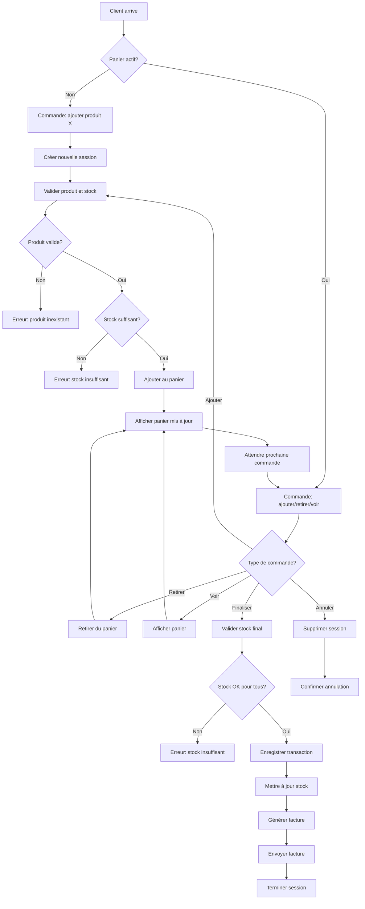
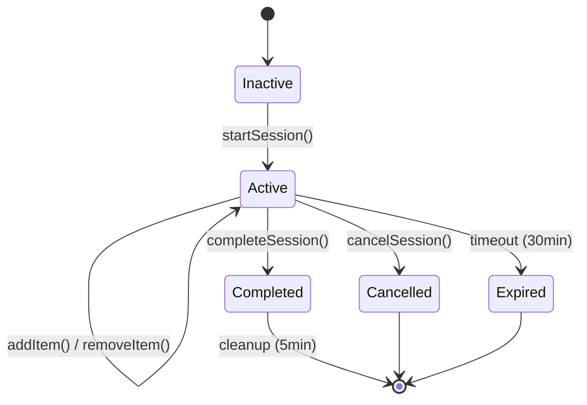
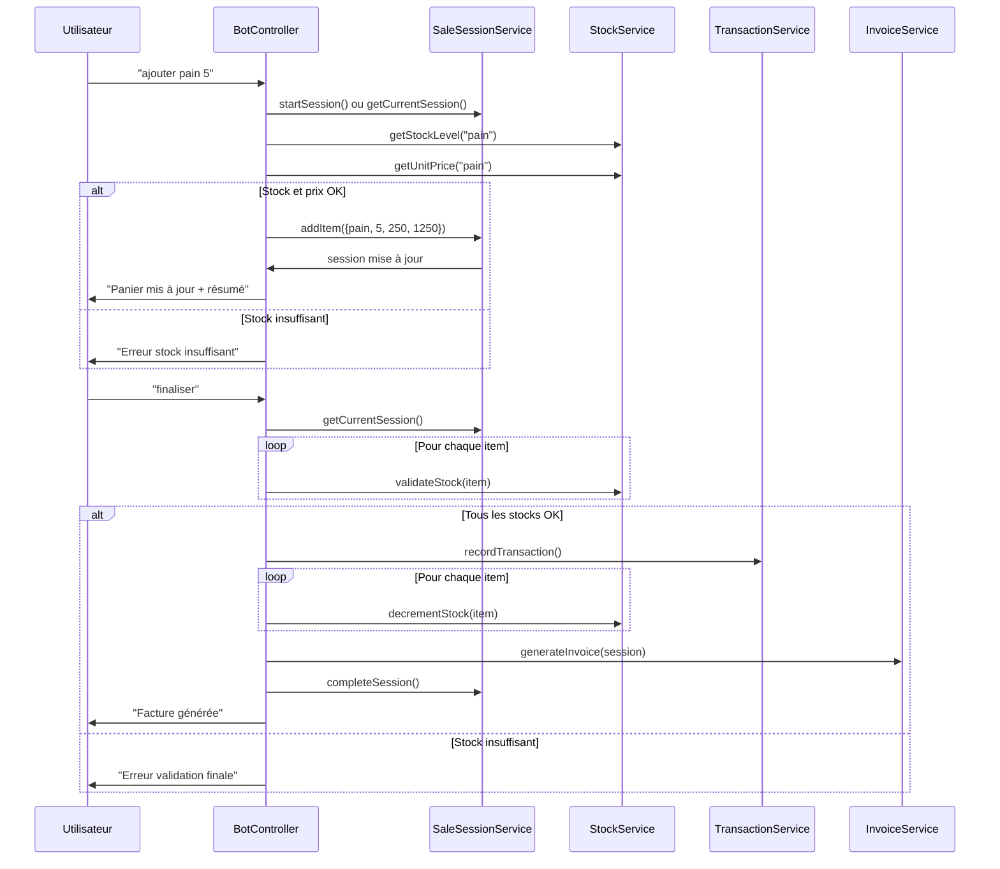
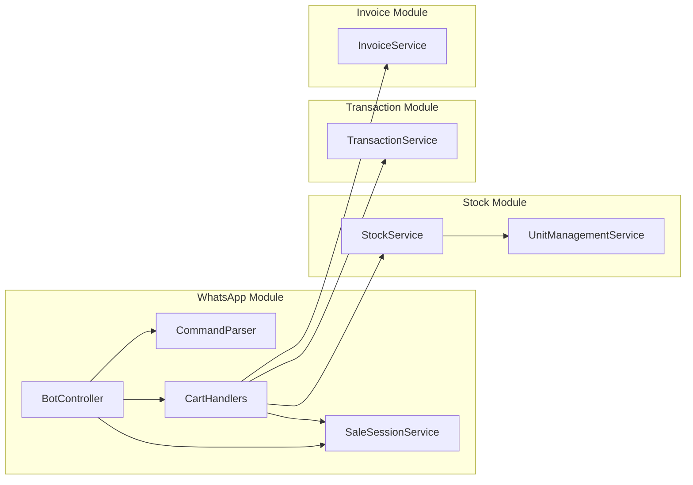
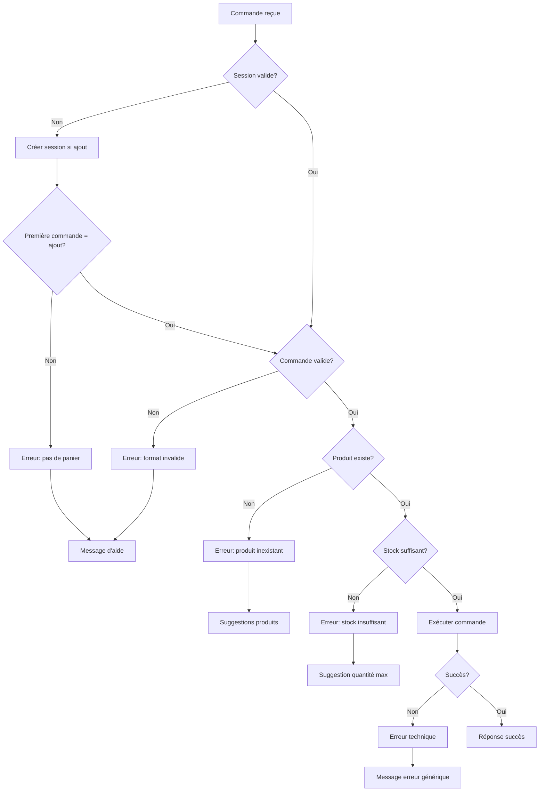

# Flux du Système de Panier

## Diagramme de Flux Principal

## États de Session

## Flux de Données

## Architecture des Services

## Gestion des Erreurs

## Optimisations et Considérations

### Performance
- **Sessions en mémoire** : Accès rapide mais perte au redémarrage
- **Cleanup automatique** : Évite l'accumulation de sessions orphelines
- **Validation lazy** : Stock validé seulement à la finalisation

### Sécurité
- **Validation utilisateur** : Chaque action vérifie l'authentification
- **Isolation des sessions** : Une session par numéro de téléphone
- **Expiration automatique** : Évite les sessions infinies

### Scalabilité
- **État stateless** : Facile à distribuer sur plusieurs instances
- **Cleanup périodique** : Maintient la mémoire propre
- **Validation différée** : Réduit les appels à la base de données

### Extensibilité
- **Interface modulaire** : Facile d'ajouter de nouveaux types de commandes
- **Handlers séparés** : Logique métier isolée
- **Services découplés** : Chaque service a une responsabilité claire

---

**Note** : Ce flux est conçu pour être robuste et gérer tous les cas d'erreur tout en offrant une expérience utilisateur fluide.