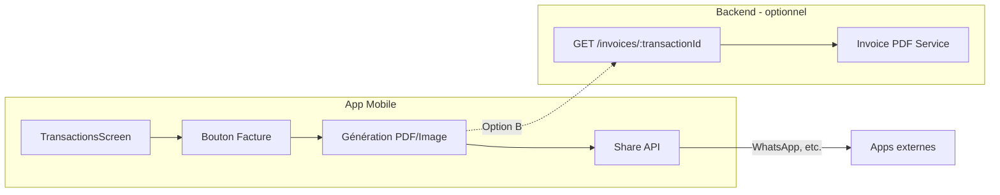

# Plan : Facture par transaction et partage (WhatsApp)

## Objectif

Permettre de générer une facture pour chaque transaction (vente ou dépense) et la partager facilement, notamment via WhatsApp.

---

## Contexte actuel

- **Transaction** : `id`, `type` (sale/expense), `amount`, `currency`, `product`, `quantity`, `description`, `isCreditSale`, `createdAt`
- **TransactionsScreen** : modale détail par transaction, pas d’action « Facture »
- **InvoiceService** (backend) : conçu pour les sessions de vente WhatsApp (panier), pas pour une transaction isolée
- **PDFGenerationService** : rapports financiers (bilan période), Puppeteer + Supabase Storage
- **Partage** : aucune API de partage côté mobile

---

## Architecture proposée



---

## Options techniques

### Option A : Génération côté mobile (recommandée)

**Avantages :** Pas de backend, pas de stockage, fonctionne hors ligne  
**Inconvénients :** Qualité PDF limitée, dépend des libs mobiles

| Étape | Techno | Description |
|-------|--------|-------------|
| 1. Rendu | `react-native-view-shot` ou `expo-print` | Capturer une vue ou générer un PDF |
| 2. Partage | `expo-sharing` | Ouvrir le sélecteur de partage (WhatsApp, etc.) |

**expo-print** : `Print.printToFileAsync()` → fichier PDF local → `Share.shareAsync()`.

### Option B : Génération côté backend

**Avantages :** PDF de qualité, template réutilisable, numérotation facture centralisée  
**Inconvénients :** Dépend du réseau, charge serveur

| Étape | Techno | Description |
|-------|--------|-------------|
| 1. Endpoint | `GET /dashboard/:businessId/invoices/:transactionId` | Retourne PDF ou URL signée (Supabase Storage) |
| 2. Service | Nouveau `TransactionInvoiceService` | Template Handlebars (comme report) |
| 3. Mobile | `fetch` + `expo-sharing` | Télécharger le PDF puis partager |

### Option C : Hybride (texte + image)

**Avantages :** Léger, partage direct en texte possible  
**Inconvénients :** Moins professionnel qu’un PDF

- Générer un texte formaté (style `InvoiceService.generateInvoiceText`)
- Optionnel : capturer une vue en image (ViewShot)
- Partager texte ou image via Share

---

## Recommandation : Option A avec expo-print

1. **Simplicité** : pas de nouveau backend
2. **Offline** : utilisable sans connexion
3. **Expo** : `expo-print` et `expo-sharing` compatibles SDK 54

---

## Contenu de la facture

### Pour une vente

- En-tête : nom entreprise, « FACTURE »
- Numéro : `FAC-{YYYYMMDD}-{transactionId.slice(0,8)}` ou séquence par entreprise
- Date, type : Vente / Vente à crédit
- Lignes : Produit, quantité, prix unitaire, montant
- Total TTC
- Mention « Merci pour votre confiance » / « MonPetitBiz »

### Pour une dépense

- En-tête : nom entreprise, « BON DE DÉPENSE » ou « REÇU »
- Même structure, libellé adapté

---

## Plan d’implémentation (Option A)

### Phase 1 : Backend (optionnel)

- [ ] Endpoint `GET /dashboard/:businessId/business-info` (nom, devise) si pas déjà exposé
- [ ] Ou réutiliser les infos du profil (business name dans `profile.business`)

### Phase 2 : Mobile – Génération

1. **Dépendances**
   - `npx expo install expo-print expo-sharing`
   - `expo-print` : génération PDF à partir de HTML
   - `expo-sharing` : partage de fichiers

2. **Utilitaire facture**
   - Créer `apps/mobile/src/utils/invoice-utils.ts`
   - `buildInvoiceHtml(transaction, businessName, currency): string`
   - Template HTML simple (table, styles inline pour PDF)

3. **Génération PDF**
   - `generateTransactionInvoicePdf(transaction, businessName): Promise<string>`
   - `Print.printToFileAsync({ html })` → chemin fichier temporaire

### Phase 3 : Mobile – UI et partage

1. **Bouton « Facture »**
   - Dans la modale détail de `TransactionsScreen`
   - À côté du bouton « Fermer »

2. **Flux**
   - Clic « Facture » → génération PDF → `Share.shareAsync()`
   - Titre : « Facture MonPetitBiz »
   - Fichier : PDF généré
   - Options : WhatsApp, Messages, etc.

3. **Gestion d’erreurs**
   - Message si échec de génération
   - Indicateur de chargement pendant la génération

### Phase 4 : Améliorations (optionnel)

- Numérotation facture persistée (backend)
- Logo entreprise
- QR code sur la facture (lien vers transaction)
- Factures pour ventes à crédit : mention « À payer » / « Crédit »

---

## Fichiers à créer/modifier

| Fichier | Action |
|---------|--------|
| `apps/mobile/package.json` | Ajouter expo-print, expo-sharing |
| `apps/mobile/src/utils/invoice-utils.ts` | Créer – HTML + génération PDF |
| `apps/mobile/src/screens/TransactionsScreen.tsx` | Modifier – bouton Facture, logique partage |

---

## Format HTML suggéré (exemple minimal)

```html
<html>
<head>
  <meta charset="utf-8">
  <style>
    body { font-family: sans-serif; padding: 20px; }
    .header { text-align: center; margin-bottom: 24px; }
    .title { font-size: 18px; font-weight: bold; }
    .row { display: flex; justify-content: space-between; margin: 8px 0; }
    .total { font-size: 16px; font-weight: bold; margin-top: 16px; }
  </style>
</head>
<body>
  <div class="header">
    <div class="title">{{businessName}}</div>
    <div>FACTURE {{invoiceNumber}}</div>
  </div>
  <div class="row"><span>Date</span><span>{{date}}</span></div>
  <div class="row"><span>Produit</span><span>{{product}}</span></div>
  <div class="row"><span>Quantité</span><span>{{quantity}}</span></div>
  <div class="row total"><span>TOTAL</span><span>{{amount}} {{currency}}</span></div>
  <p style="margin-top: 24px; font-size: 11px; color: #666;">Généré par MonPetitBiz</p>
</body>
</html>
```

---

## Vérification

- [ ] Générer une facture pour une vente
- [ ] Générer un reçu pour une dépense
- [ ] Partager sur WhatsApp et vérifier la réception du PDF
- [ ] Tester hors ligne (génération locale)
